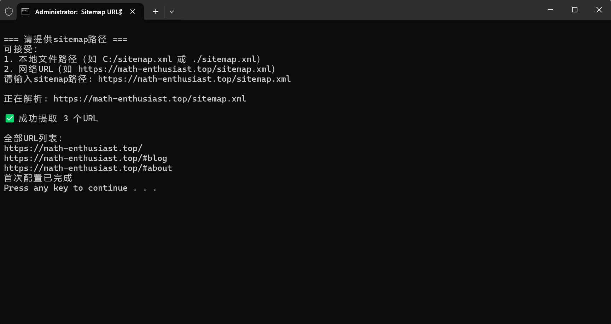

<h1>Sitemap Parser Tool 🌐🔗</h1>

<a href="README_zh.md">简体中文</a>  |  ENGLISH

## ✨ Project Introduction

A high-efficiency tool for extracting URLs from sitemap.xml, supporting multiple sitemaps and webpage titles extraction.

---

## 👨‍💻 Author Info
**Pengbo Lu**  
Visit my personal blog: [https://math-enthusiast.top](https://math-enthusiast.top)

---

## 🚀 Key Features
- ✅ Supports parsing multiple sitemap.xml simultaneously
- 🌍 Works with both online and local sitemap files
- 📝 Automatically saves configuration
- 📊 Smart console output control (20 items threshold)
- 📂 Automatically generates urls.txt file

---

## 🛠️ Usage Guide

1. **Install Dependencies**  
   Run `先安装必要的库.bat` (Install Required Libraries.bat)

2. **Run Program**  
   Run `整合链接.bat` (Process Links.bat)

3. **First Time Use**  
   - Enter sitemap URL (supports web URL or local path)  
   - Example inputs:  
     `https://math-enthusiast.top/sitemap.xml`  
     or `./sitemap.xml`  
   

4. **Configuration File**  
   Automatically generates `sitemap_config.txt` which can be manually modified

---

## 📊 Output Examples

### Few Links (≤20 items)
- Console shows all links
- Generates `urls.txt` file  

### Many Links (>20 items)
- Console shows first 20 links
- `urls.txt` contains all links  

### Parsing Failure

### Local Sitemap Processing

---

## 📜 License
This project is licensed under the MIT License - see the [LICENSE](LICENSE) file for details