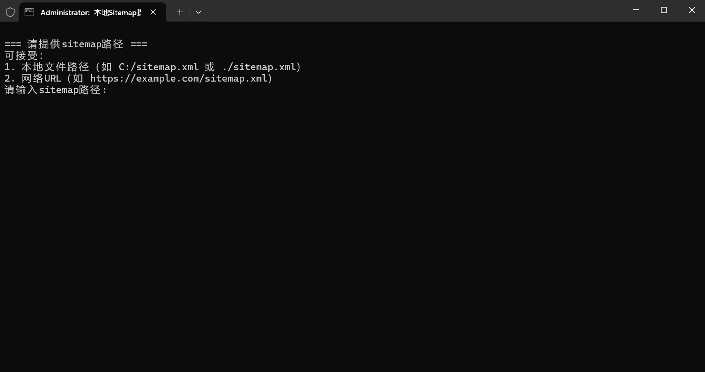
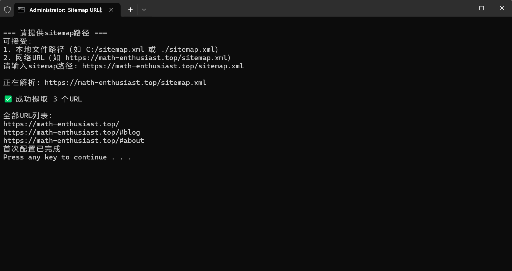
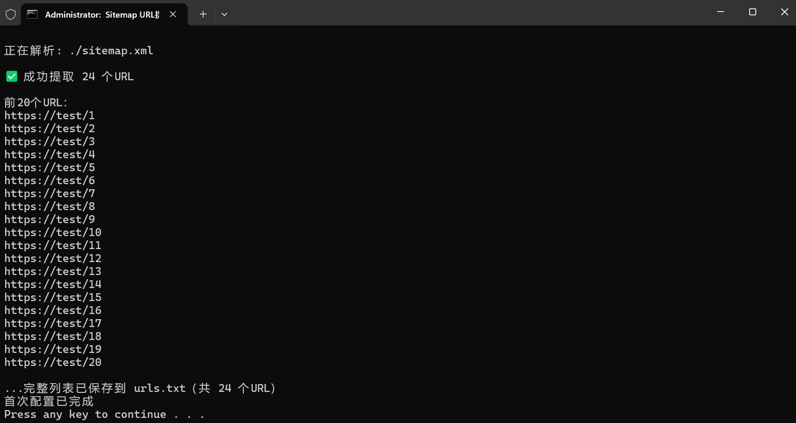
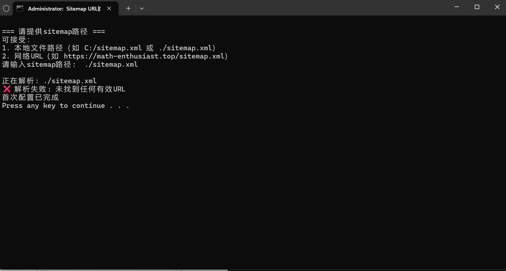
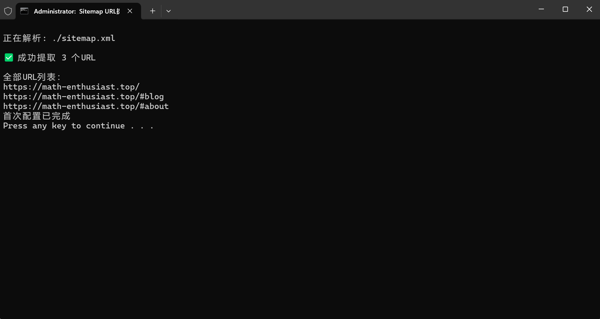

<h1>Sitemap 解析工具 🌐🔗</h1>

简体中文  |  <a href="README.md">ENGLISH</a>

## ✨ 项目简介

一款高效提取sitemap.xml中URL链接的工具，支持同时提取多个sitemap和网页标题。

---

## 👨‍💻 作者信息

**卢鹏博**  
欢迎访问我的个人博客：[https://math-enthusiast.top](https://math-enthusiast.top)

---

## 🚀 功能特点

- ✅ 支持多个sitemap.xml同时解析
- 🌍 支持在线和本地sitemap文件
- 📝 自动保存配置，避免重复输入
- 📊 智能控制台输出控制（20条为分界）
- 📂 自动生成urls.txt文件

---

## 🛠️ 使用方法

1. **安装依赖库**  
   双击运行`先安装必要的库.bat`

2. **运行程序**  
   双击运行`整合链接.bat`

3. **首次使用**  
   
   - 输入sitemap链接（支持在线URL或本地路径）  
   - 示例输入：  
     `https://math-enthusiast.top/sitemap.xml`  
     或 `./sitemap.xml`  
     

4. **配置文件**  
   自动生成`sitemap_config.txt`，可手动修改其中的sitemap链接

---

## 📊 输出示例

### 少量链接（≤20条）

- 控制台显示全部链接
- 同时生成`urls.txt`文件  
  

### 大量链接（>20条）

- 控制台显示前20条链接
- `urls.txt`包含全部链接  
  

### 解析失败情况

### 本地sitemap处理

---

## 📜 许可证

本项目采用MIT许可证 - 详见[LICENSE](LICENSE)文件

